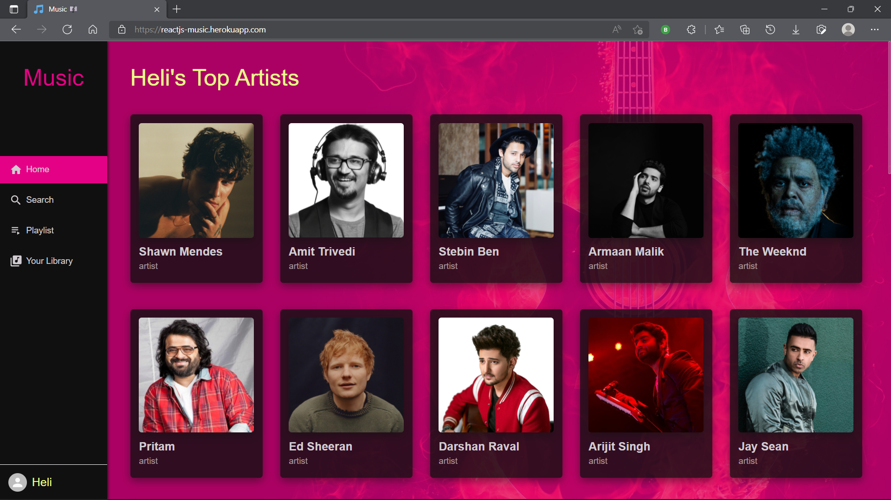
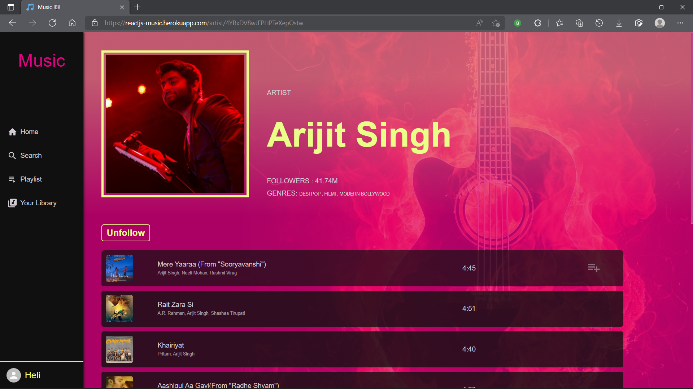
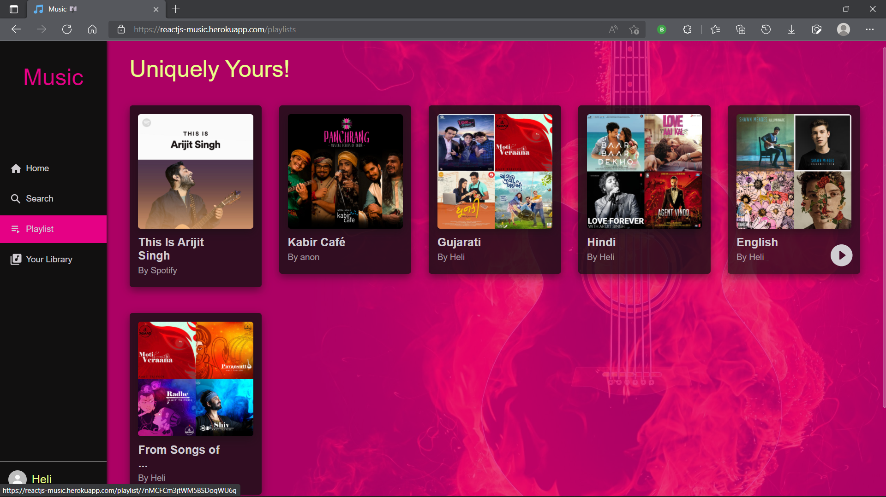
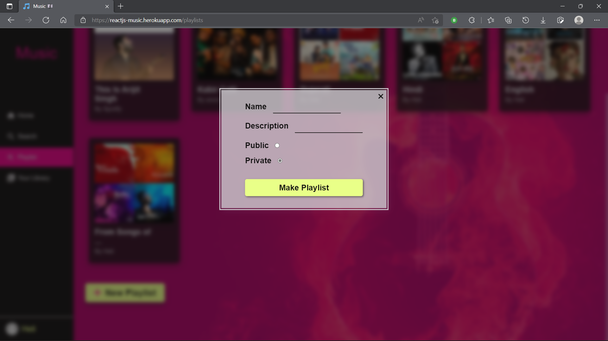
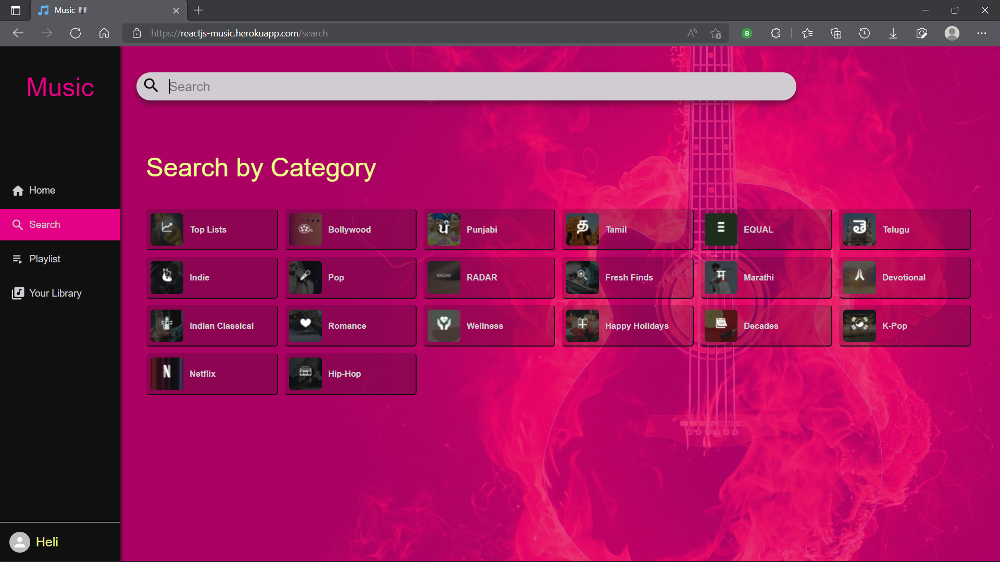

# Music
Web app made using MERN stack

### Here is a look of various web pages
* Home page contains user's top artists and top releases

* Artist page contains information about artist, songs from the artist also user can follow or unfollow artist from here

* Playlist page contains user's all the playlist, you can go to any playlist which contains info about playlist, songs from that playlist
 

* User can also create new playlist

* Search page gives songs, albums, artist, playlists based on searched keyword, user can also search using givem categories 

